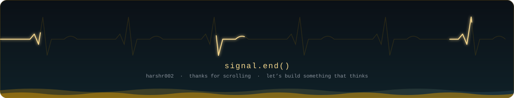

  

## 🧬 About Me

## ⚙️ How I Build

## 🚀 Featured Projects

<table>
<tr>
<td width="50%" align="center">

 

</td>
<td width="50%" align="center">

 

</td>
</tr>
<tr>
<td width="50%" align="center">

 

</td>
<td width="50%" align="center">

 

</td>
</tr>
<tr>
<td width="50%" align="center">

 

</td>
<td width="50%" align="center">

 

</td>
</tr>
</table>

## 💻 Tech Stack

<table>
<tr>
<td width="190" align="center"><b>⌨️ Languages</b></td>
<td>

</td>
</tr>

<tr>
<td align="center"><b>🧠 AI / ML / Data Science</b></td>
<td>

 

</td>
</tr>

<tr>
<td align="center"><b>🤖 GenAI & LLMs</b></td>
<td>

 

</td>
</tr>

<tr>
<td align="center"><b>🧲 Vector Databases</b></td>
<td>

</td>
</tr>

<tr>
<td align="center"><b>⚙️ Backend</b></td>
<td>

 

</td>
</tr>

<tr>
<td align="center"><b>🎨 Frontend</b></td>
<td>

 

</td>
</tr>

<tr>
<td align="center"><b>🗄️ Databases</b></td>
<td>

 

</td>
</tr>

<tr>
<td align="center"><b>🛠️ Data Engineering</b></td>
<td>

 

</td>
</tr>

<tr>
<td align="center"><b>🏛️ Data Platforms</b></td>
<td>

 

</td>
</tr>

<tr>
<td align="center"><b>☁️ Cloud & DevOps</b></td>
<td>

 

</td>
</tr>

<tr>
<td align="center"><b>🔁 MLOps & Monitoring</b></td>
<td>

 

</td>
</tr>

<tr>
<td align="center"><b>🧰 Tools & Platforms</b></td>
<td>

 

</td>
</tr>

<tr>
<td align="center"><b>✏️ Design</b></td>
<td>

 

</td>
</tr>
</table>

## 📡 GitHub Telemetry

  

  

## 🐍 Commit Stream

<picture>
  <source media="(prefers-color-scheme: dark)" srcset="https://raw.githubusercontent.com/harshr002/harshr002/output/github-snake-dark.svg" />
  <source media="(prefers-color-scheme: light)" srcset="https://raw.githubusercontent.com/harshr002/harshr002/output/github-snake.svg" />
  
</picture>

## 🤝 Connect

  

